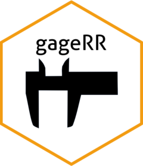

# gageRR 

<!-- README.md is generated from README.Rmd. Please edit that file -->

```{r, include = FALSE}
knitr::opts_chunk$set(
  collapse = TRUE,
  comment = "#>",
  fig.path = "man/figures/README-",
  out.width = "100%"
)
```


<!-- badges: start -->
<!-- badges: end -->

Analyzing measurement system error is a critical component of the manufacturing process in numerous industries.  While a number of methods exist to analyze measurement error they can all be broadly described as repeatability and reproducibilty studies (or often referred to as Gage R&R studies).  Industries can then provide guidelines or limitations on the amount of error that is acceptable for a given product feature based on the outcome of a Gage R&R study.

The gageRR package provides two methods to analyze repeatability and reproducibility: Analysis of Variance (ANOVA) method and Average and Range method.  These methods require a balanced study, that is the same number of repetitions for each operator and part combination. 

## Installation

You can install the development version of gageRR from [GitHub](https://github.com/) with:

``` r
# install.packages("devtools")
devtools::install_github("warrenjonahb/gageRR")
```
After installation you can run the Shiny App with:

```r
shiny::runApp(system.file("app", package = "gageRR"))
```

## Example

This is a basic example which takes the appropriately formatted data (one row per operator and part measurement) and calculates summary gage evaluation statistics.  For more information please see the gageRR_vignette. 

Here, a sample dataset is created to demonstrate the gageRR functions:

```{r data}
library(gageRR)
data = data.frame(
SN = c(
'SerialNumber_01',
'SerialNumber_01',
'SerialNumber_02',
'SerialNumber_02',
'SerialNumber_01',
'SerialNumber_01',
'SerialNumber_02',
'SerialNumber_02'),

Operator = c(
'Operator_01',
'Operator_01',
'Operator_01',
'Operator_01',
'Operator_02',
'Operator_02',
'Operator_02',
'Operator_02'),

Measure = c(
0.0172,
0.0177,
0.0155,
0.0159,
0.0174,
0.0181,
0.0152,
0.0176))

```

Next we can calculate the sum of squares and ANOVA variance components:

```{r anova}
ss_calcs(data, part = 'SN', operator = 'Operator', meas = 'Measure')
anova_var_calcs(data, part = 'SN', operator = 'Operator', meas = 'Measure')
```

With these variance components we can then calculate the final gage evaluation statistics:

```{r anova_gage_eval}
grr_calc(data, part = 'SN', operator = 'Operator', meas = 'Measure', LSL = 0, USL = .040, method = 'anova')

```
